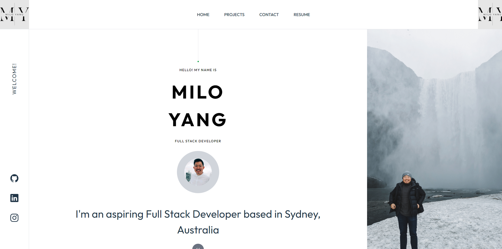

# My React Portfolio

Welcome to my React Portfolio! This portfolio showcases my skills, projects, and experiences as a developer.

## Table of Contents
- [About](#about)
- [Features](#features)
- [Projects](#projects)
- [Technologies Used](#technologies-used)
- [Setup](#setup)
- [Usage](#usage)
- [License](#license)
- [Contact](#contact)

## About

This React Portfolio is designed to provide a comprehensive overview of my work, skills, and achievements. It serves as a digital resume and portfolio, making it easy for others to learn more about me and my expertise.

(<a href="#readme-top">back to top</a>)

## Features

- **Responsive Design:** The portfolio is responsive and accessible on various devices.
- **Project Showcase:** Highlight key projects with details, including technologies used, descriptions, and live/demo links.
- **Contact Form:** Easily connect with me using the contact form provided.

(<a href="#readme-top">back to top</a>)

## Projects

Here are some of the key projects featured in this portfolio:

1. **[DIY Buddy](#)**
   - Description: A DIY Project Planner that allows you to login and plan your DIY projects, along with keeping track of your budget estimation and materials needs.
   - Technologies: "JavaScript", "MySQL", "Express.js", "Node.js", "Sequelize
   - Demo: [https://diy-buddy-app-final-3c3eca16d427.herokuapp.com/](#)

2. **[Park With Access](#)**
   - Description: Park with Access App is a dedicated solution, committed to enhancing urban mobility by providing personalized parking options for everyone.
   - Technologies: "HTML", "CSS", "JavaScript", "Tailwind"
   - Demo: [https://honguyen00.github.io/map-parking/](#)

(<a href="#readme-top">back to top</a>)

## Technologies Used

- React
- HTML, CSS, JavaScript
- Netlify

(<a href="#readme-top">back to top</a>)

## Setup

To run this portfolio locally, follow these steps:

1. Clone the repository: `git clone https://github.com/miloyang/MY.git`
2. Navigate to the project directory: `cd MY`
3. Install dependencies: `npm install`
4. Start the development server: `npm start`

(<a href="#readme-top">back to top</a>)

## Usage

To use the deployed site, please head over to: https://65a61431f8ae31804770c9ec--resplendent-marshmallow-fb879b.netlify.app/

You should see the page as below:

(<a href="#readme-top">back to top</a>)

## License

Permission to use this application is granted under the MIT license.
Click on the link for more information: [MIT License Information](https://opensource.org/licenses/MIT)

(<a href="#readme-top">back to top</a>)

## Contact

For any inquiries, reach out to me at [miloyang9@gmail.com](mailto:miloyang9@gmail.com).

(<a href="#readme-top">back to top</a>)
